# 1. Лабораторная работа №4: Запуск сайта в контейнере

### 2. Цель работы: Выполнив данную работу студент сможет подготовить образ контейнера для запуска веб-сайта на базе Apache HTTP Server + PHP (mod_php) + MariaDB.

### 3. Задание: Создать Dockerfile для сборки образа контейнера, который будет содержать веб-сайт на базе Apache HTTP Server + PHP (mod_php) + MariaDB. База данных MariaDB должна храниться в монтируемом томе. Сервер должен быть доступен по порту 8000. Установить сайт WordPress. Проверить работоспособность сайта.

### 4. Описание выполнения работы с ответами на вопросы.

## Извлечение конфигурационных файлов apache2, php, mariadb из контейнера
Постройте образ контейнера с именем apache2-php-mariadb:

docker build -t apache2-php-mariadb .

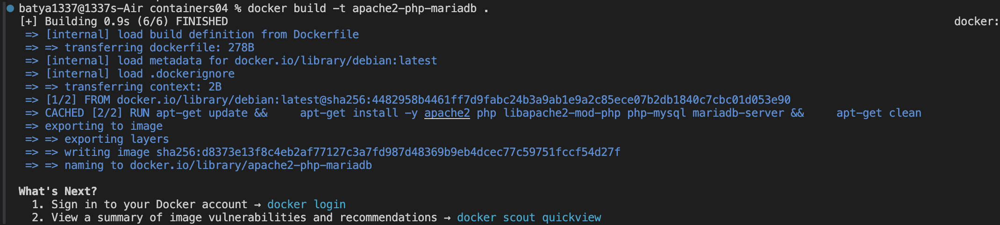

Создайте контейнер apache2-php-mariadb из образа apache2-php-mariadb и запустите его в фоновом режиме с командой запуска bash.

docker run -d -it --name apache2-php-mariadb apache2-php-mariadb bash

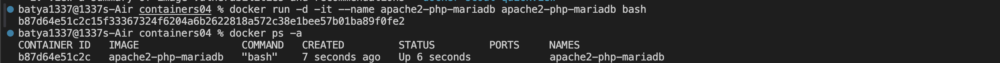

Скопируйте из контейнера файлы конфигурации apache2, php, mariadb в папку files/ на компьютере. Для этого, в контексте проекта, выполните команды:

docker cp apache2-php-mariadb:/etc/apache2/sites-available/000-default.conf files/apache2/

docker cp apache2-php-mariadb:/etc/apache2/apache2.conf files/apache2/

docker cp apache2-php-mariadb:/etc/php/8.2/apache2/php.ini files/php/

docker cp apache2-php-mariadb:/etc/mysql/mariadb.conf.d/50-server.cnf files/mariadb/

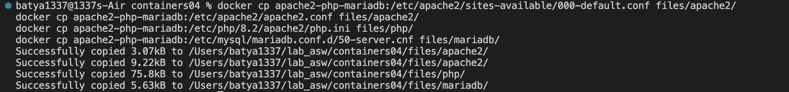

# Настройка конфигурационных файлов

## Конфигурационный файл apache2

Откройте файл files/apache2/000-default.conf, найдите строку #ServerName www.example.com и замените её на ServerName localhost.

Найдите строку ServerAdmin webmaster@localhost и замените в ней почтовый адрес на свой.

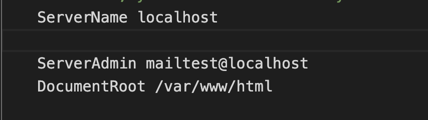

После строки DocumentRoot /var/www/html добавьте следующие строки:

DirectoryIndex index.php index.html

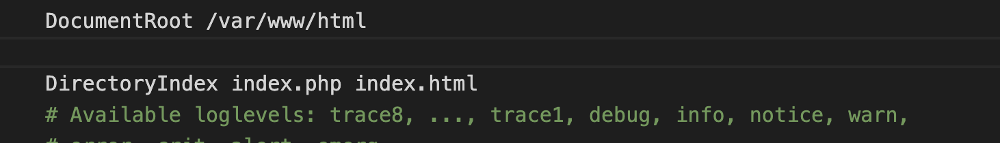

В конце файла files/apache2/apache2.conf добавьте следующую строку:

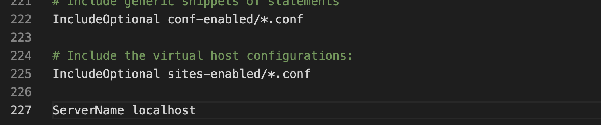

## Конфигурационный файл php

Откройте файл files/php/php.ini, найдите строку ;error_log = php_errors.log и замените её на error_log = /var/log/php_errors.log.

Настройте параметры memory_limit, upload_max_filesize, post_max_size и max_execution_time следующим образом:

memory_limit = 128M

upload_max_filesize = 128M

post_max_size = 128M

max_execution_time = 120

## Конфигурационный файл mariadb

Откройте файл files/mariadb/50-server.cnf, найдите строку #log_error = /var/log/mysql/error.log и раскомментируйте её.

# Создание скрипта запуска

Создайте в папке files папку supervisor и файл supervisord.conf со следующим содержимым:

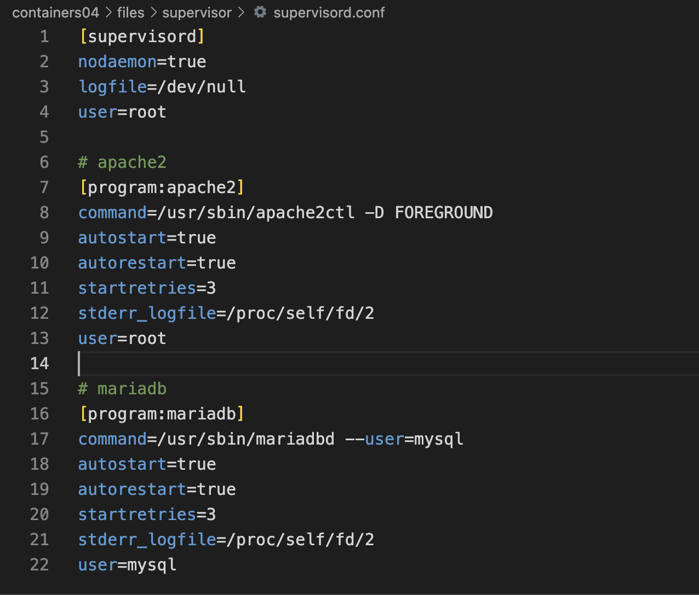

# Создание Dockerfile

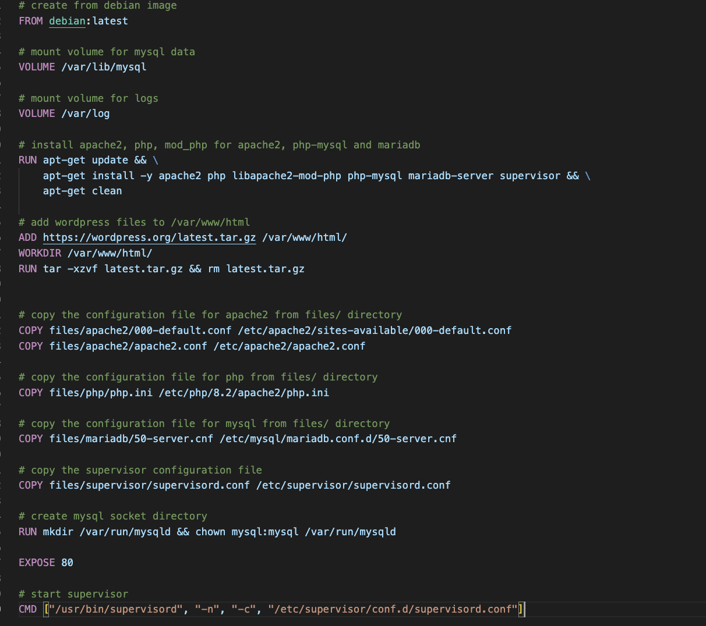

Соберите образ контейнера с именем apache2-php-mariadb и запустите контейнер apache2-php-mariadb из образа apache2-php-mariadb.

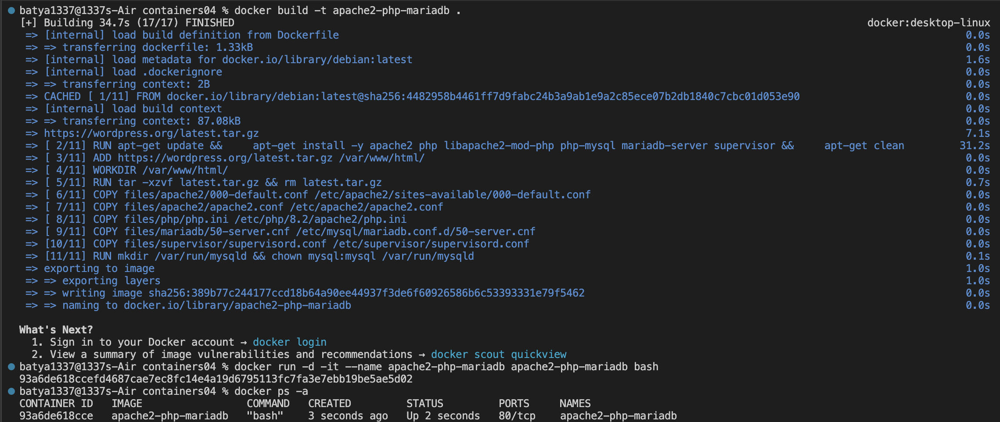

Проверьте наличие сайта WordPress в папке /var/www/html/.

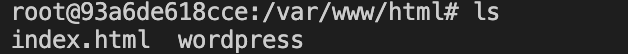

Проверьте изменения конфигурационного файла apache2.

cat /etc/apache2/apache2.conf

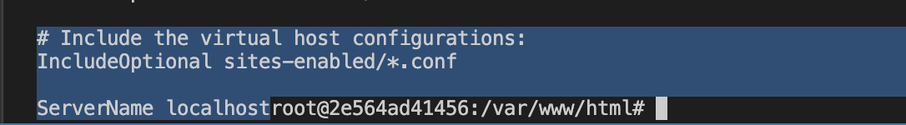

# Создание базы данных и пользователя

mysql

CREATE DATABASE wordpress;

CREATE USER 'wordpress'@'localhost' IDENTIFIED BY 'wordpress';

GRANT ALL PRIVILEGES ON wordpress.* TO 'wordpress'@'localhost';

FLUSH PRIVILEGES;

EXIT;

# Создание файла конфигурации WordPress

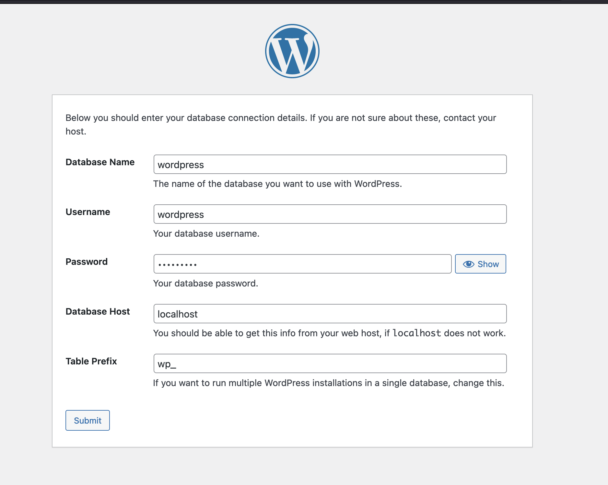

# Запуск и тестирование

Пересоберите образ контейнера с именем apache2-php-mariadb и запустите контейнер apache2-php-mariadb из образа apache2-php-mariadb. Проверьте работоспособность сайта WordPress.

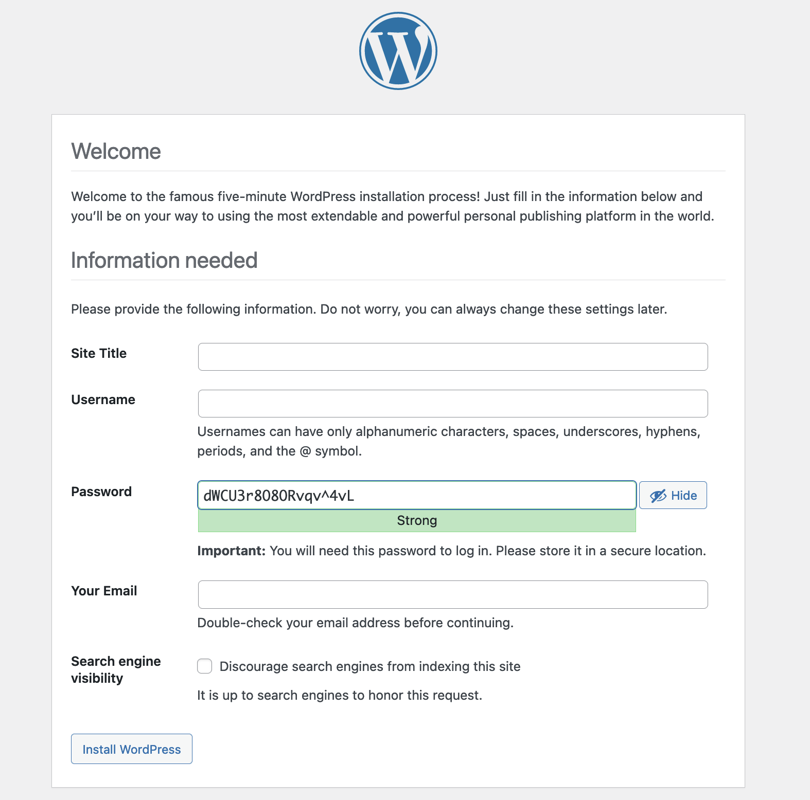

# Ответьте на вопросы:

1.Какие файлы конфигурации были изменены?

Были изменены файлы: 000-default.conf, apache2.conf, php.ini, 50-server.cnf

2.За что отвечает инструкция DirectoryIndex в файле конфигурации apache2?

Инструкция DirectoryIndex в файле конфигурации Apache2 указывает серверу, какой файл использовать в качестве главного файла при обращении к директории.

3.Зачем нужен файл wp-config.php?

Файл wp-config.php - это файл конфигурации для системы управления контентом WordPress. В нем содержатся различные настройки, такие как параметры подключения к базе данных, ключи безопасности, опции отладки и многие другие. Этот файл является важной частью установки WordPress и используется для настройки и определения параметров работы сайта.

4.За что отвечает параметр post_max_size в файле конфигурации php?

Параметр post_max_size в файле конфигурации PHP определяет максимальный размер данных, который может быть отправлен через HTTP POST-запрос. Это включает в себя данные из форм, загружаемые файлы и другие данные, передаваемые методом POST. Если размер передаваемых данных превышает установленное значение post_max_size, PHP отклонит запрос.

5.Укажите, на ваш взгляд, какие недостатки есть в созданном образе контейнера?

Думаю, что один из недостатков это копирование файлов между хост - контейнер и наоборот в соображениях безопасности, а также docker desktop показывает несколько уязвимостей в созданном контейнере:

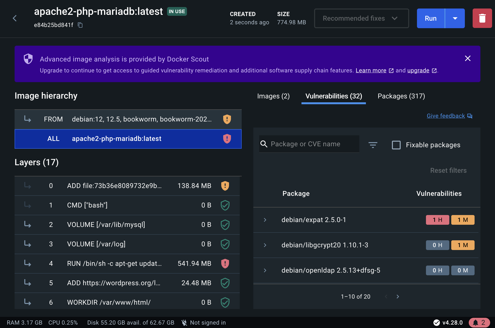

# Вывод:

В ходе выполнения данной лабораторной работы был успешно подготовлен образ контейнера, объединяющий в себе Apache HTTP Server, PHP и MariaDB. Работоспособность сайта на базе WordPress была проверена, и контейнер был настроен таким образом, чтобы база данных MariaDB хранилась в монтируемом томе.
